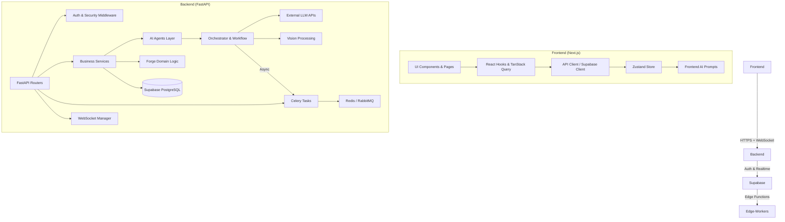

## PuppyForge-AI 项目架构文档

**更新日期**：2026年6月  
**项目概述**：PuppyForge-AI 是一个 AI 驱动的宠物健康管理与成长锻造平台，专注于宠物（以狗狗为主）健康数据追踪、智能分析、个性化养护建议及社区交互。采用现代化前后端分离架构，支持高可用、可扩展部署，集成 LLM Agent 能力实现智能宠物健康助手。

---

## 1. 架构目标与核心原则

- **高可用**：多区域部署、自动扩缩容、故障隔离。
- **可扩展**：模块化设计、事件驱动、微服务友好。
- **可维护**：清晰分层、强类型、契约优先、自动化测试。
- **工程效能**：DevOps 流水线、IaC、监控可观测性。
- **AI-First**：将 AI Agent 作为核心能力，与业务逻辑深度融合。
- **技术选型平衡**：开发者体验、生产稳定性、成本控制三者兼顾。

---

## 2. 整体技术栈

**前端**：
- Next.js 14+（App Router + React Server Components）
- TypeScript、Tailwind CSS、Shadcn/ui
- Zustand / Jotai（状态管理）
- TanStack Query（数据获取）
- Playwright / Vitest（测试）

**后端**：
- FastAPI（Python 3.11+）
- SQLAlchemy 2.0 + Alembic（ORM & 迁移）
- Pydantic v2（数据校验）
- Celery + Redis（异步任务）
- WebSocket 支持
- LangChain / LlamaIndex（AI Agent 编排）

**基础设施**：
- Supabase（PostgreSQL + Auth + Storage + Edge Functions）
- Docker + Docker Compose
- Vercel（前端部署）
- Redis / RabbitMQ（缓存 & 消息队列）
- Prometheus + Grafana + OpenTelemetry（可观测性）
- Sentry（错误追踪）

**AI 相关**：
- OpenAI / Anthropic / Grok API
- 多 Agent 协作框架
- 计算机视觉（宠物图像分析）

---

## 3. 项目目录结构

```bash
PuppyForge-AI/
├── frontend/                          # 前端主应用
├── backend/                           # Python FastAPI 服务
├── supabase/                          # Supabase 配置与 migrations
├── edge-workers/                      # 边缘函数 / Cloudflare Workers
├── packages/                          # Turborepo 子包（共享类型、UI 组件等）
├── .github/                           # CI/CD workflows
├── docs/                              # 架构文档、API 规范
├── infra/                             # Terraform / IaC
├── docker/                            # Dockerfile 与 compose 配置
├── scripts/                           # 运维脚本
├── .env.example
├── docker-compose.yml
├── turbo.json                         # Monorepo 配置（如果使用 Turborepo）
├── vercel.json
└── README.md
```

### 3.1 前端目录详解（frontend/）

```bash
frontend/
├── app/                               # App Router
│   ├── (auth)/                        # 认证相关路由组
│   ├── (dashboard)/                   # 仪表盘布局
│   ├── pets/                          # 宠物管理页面
│   ├── health/                        # 健康分析页面
│   ├── ai-chat/                       # AI 对话界面
│   ├── layout.tsx
│   └── globals.css
├── components/
│   ├── ui/                            # 基础 Shadcn 组件
│   ├── domain/                        # 业务域组件（PetCard、HealthChart）
│   ├── layout/                        # 布局组件（Sidebar、Header）
│   └── common/                        # 通用组件
├── hooks/                             # 自定义 Hooks
├── lib/                               # 工具与客户端
│   ├── supabase.ts                    # Supabase 客户端
│   ├── api.ts                         # API 请求封装
│   └── utils.ts
├── store/                             # 全局状态
├── types/                             # TypeScript 类型定义（与后端同步）
├── ai/                                # 前端 AI Prompt 模板与 Agent 逻辑
├── public/                            # 静态资源
├── styles/                            # 全局样式
└── __tests__/                         # 测试
```

### 3.2 后端目录详解（backend/）

```bash
backend/
├── app/
│   ├── main.py                        # FastAPI 应用入口
│   ├── core/                          # 核心配置、安全、DB
│   ├── models/                        # Pydantic + SQLAlchemy 模型
│   ├── schemas/                       # 请求/响应 DTO
│   ├── api/                           # 路由模块
│   │   ├── v1/
│   │   │   ├── pets.py
│   │   │   ├── health.py
│   │   │   ├── ai.py
│   │   │   └── websocket.py
│   ├── agents/                        # AI Agent 实现
│   ├── services/                      # 业务服务层
│   ├── tasks/                         # Celery 任务
│   ├── forge/                         # 核心业务域（宠物锻造引擎）
│   ├── vision/                        # 图像分析服务
│   ├── orchestrator/                  # AI 流程编排
│   ├── dependencies.py                # FastAPI 依赖注入
│   └── utils.py
├── alembic/                           # 数据库迁移
├── tests/                             # 单元 & 集成测试
├── pyproject.toml
├── requirements.txt
└── Dockerfile
```

---

## 4. 模块间调用关系与数据流



**关键调用路径**：

1. **用户查看宠物健康**：前端 `HealthPage` → `usePetHealth` Hook → API Client → Backend `/health/report` → Orchestrator → Agents → LLM + Vision → 返回结果并推送到 WebSocket。
2. **AI 智能问诊**：前端 Chat 组件 → Agent Prompt → Backend AI Route → Multi-Agent Collaboration → 结果持久化到 DB。
3. **异步健康报告**：前端触发 → Celery Task → 后台生成 PDF/图表 → 通过 Email 或 App 内通知推送。
4. **数据同步**：Supabase Realtime → Frontend 订阅 → 实时更新仪表盘。

---

## 5. 关键架构决策

- **分层架构**：Presentation → Application → Domain → Infrastructure。
- **领域驱动设计 (DDD)**：`forge/`、`agents/` 等按业务域组织。
- **事件驱动**：内部使用 Domain Events + Outbox Pattern。
- **契约优先**：OpenAPI Spec 作为前后端唯一真理来源，使用代码生成工具同步类型。
- **安全设计**：JWT + Row Level Security (Supabase) + API Rate Limiting + 输入校验。
- **性能优化**：Redis 缓存、数据库读写分离、CDN 静态资源、图像压缩。
- **可观测性**：结构化日志、分布式追踪、业务指标监控。

---

## 6. 部署与运维架构

- **本地开发**：`docker-compose up` 启动全栈。
- **生产部署**：
  - 前端：Vercel（边缘部署）
  - 后端：Kubernetes / Fly.io / AWS ECS
  - 数据库：Supabase Pro 或自托管 PostgreSQL
- **CI/CD**：GitHub Actions（Lint → Test → Build → Deploy）。
- **灰度与回滚**：Feature Flags + Blue-Green 部署。

---

## 7. 潜在风险与演进路线

**当前风险**：
- Orchestrator 可能成为单点复杂性瓶颈。
- 前后端类型同步维护成本较高。
- AI 调用成本与延迟控制。

**演进建议**：
1. 引入 **Event Sourcing + CQRS** 处理复杂健康数据。
2. 将 AI Agents 拆分为独立微服务（Agent-as-a-Service）。
3. 前端采用 **Module Federation** 实现微前端。
4. 增加 **Feature-Sliced Design** 进一步规范化代码结构。
5. 引入 **Backstage** 或内部开发者门户提升工程效能。

---

**架构总结**：本项目采用**现代全栈 + AI 原生**设计，在保持开发敏捷性的同时，为未来高并发与复杂 AI 场景预留了充足扩展空间。通过清晰的模块划分、严格的分层与优秀的 DevOps 实践，确保系统长期可维护与业务快速迭代。

---

**文档维护说明**：  
此文档为活文档，建议与代码同步更新。欢迎团队成员提出架构改进建议。

如需补充**序列图**、**C4 模型图**、**数据库 ER 图** 或特定模块的深度设计，请随时告知，我将进一步完善。 

**架构师寄语**：用架构思维持续降低复杂度，用工程实践保障交付质量。
