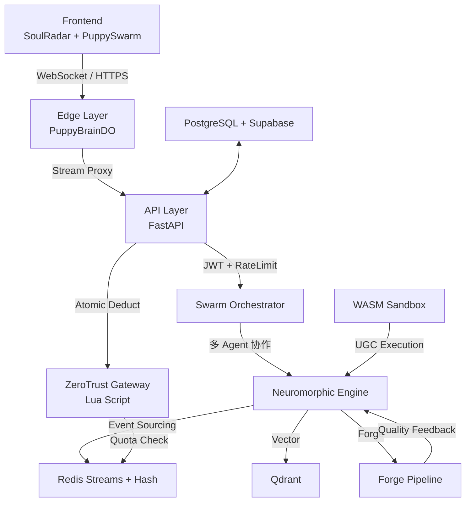

# PuppyForge-AI 完整架构总结文档（基于知识图谱深度分析）

---

## 1. 项目总体定位与架构愿景

PuppyForge-AI 是一个 **AI 原生宠物灵魂引擎平台**，核心目标是通过神经形态计算、多 Agent Swarm 协作和锻造流水线，为每只宠物构建可演化、可交互的“数字灵魂”。系统强调**实时人格演化（Trait Drift）**、**事件溯源**、**零信任算力控制**和**边缘低延迟状态同步**。

**核心架构原则**：
- **生物启发设计**：模拟神经可塑性（Neuromorphic Engine + Trait Drift）
- **分层解耦 + 事件驱动**：清晰 7 层架构，Event Sourcing 贯穿核心
- **AI-First + 双 Swarm**：前后端协同的多 Agent 系统
- **高可用与安全**：ZeroTrust + WASM 沙箱 + RLS + 边缘持久化
- **可扩展性**：向量数据库、异步流水线、边缘计算

---

## 2. 7 层架构详解（对应知识图谱 Layers）

### 2.1 边缘计算层（Edge Layer）
- **核心组件**：Cloudflare Durable Objects（PuppyBrainDO）
- **职责**：全球边缘维持宠物实时灵魂状态、WebSocket 多模态流（视频/音频）、低延迟广播
- **关键文件**：
  - `edge-workers/src/durable-objects/PuppyBrain.ts`
  - `edge-workers/src/stream-proxy.ts`
- **调用关系**：Edge → API Layer（反向代理流）→ Frontend 实时更新

### 2.2 前端展示层（Frontend Layer）
- **技术栈**：Next.js 14 App Router、React 18、Three.js、Zustand、Framer Motion、Tailwind v4、Serwist PWA
- **亮点**：
  - SoulRadar 3D 人格雷达图
  - PuppySwarm（轻量前端 Agent：diagnosis → prediction → growth → rebel）
  - soul-websocket 断线重连 + 实时 Trait 更新
- **目录**：`frontend/app/`、`frontend/components/`、`frontend/ai-agents/`、`frontend/store/`
- **关键文件**：
  - `SoulRadar.tsx`
  - `swarm-orchestrator.ts`
  - `usePuppyStore.ts`
  - `soul-websocket.ts`

### 2.3 API 网关层（API Layer）
- **框架**：FastAPI（异步）
- **特性**：JWT 认证（RS256）、slowapi 限流、全局异常处理、安全头
- **路由模块**：auth、vision、soul、interact、ws（多模态）
- **关键文件**：`backend/main.py`、`backend/gateway/multimodal_ws.py`

### 2.4 AI Swarm 层（Agent Layer）
- **设计**：9 个 Agent（前后端双 Swarm）
- **核心 Agent**：
  - DiagnosisAgent、VisionAgent、GrowthAgent、PredictionAgent、RebelAgent、MemoryWeaver、TraitDriftAgent 等
- **编排**：`backend/agents/orchestrator.py` + `frontend/ai-agents/core/swarm-orchestrator.ts`
- **技术**：litellm 多模型适配、tenacity 重试

### 2.5 神经形态引擎层（Core / Neuromorphic Layer）
- **核心创新**：`backend/core/neuromorphic_engine.py`
- **流程**：
  1. InteractionEvent 写入 Redis Stream（事件溯源）
  2. 生成向量存 Qdrant
  3. LLM 计算 Trait Drift（trust/neuroticism/energy/attachment）
  4. Forge Pipeline 反馈调整
  5. 更新 Redis Hash 实时人格状态
- **调用**：Swarm → Neuromorphic → Forge → Data Layer

### 2.6 Forge Pipeline（锻造引擎）
- **四阶段流水线**（`backend/forge/pipeline.py`）：
  1. Prompt Alchemy（优化提示词）
  2. Parallel Forging（多变体生成）
  3. Adversarial Validation（VLM 质检）
  4. Crystallize Asset（向量化存 Qdrant）
- **价值**：生成高质量、可持久化的宠物灵魂资产

### 2.7 安全与基础设施层 + 数据持久化层
- **ZeroTrust Gateway**（`backend/security/zero_trust_gateway.py`）：Redis Lua 原子扣减算力（forge:5000、interact:50 等）
- **WASM Sandbox**：Wasmtime + Fuel Metering，支持 UGC 安全执行
- **数据层**：
  - **PostgreSQL**：结构化数据（SQLModel）
  - **Supabase**：RLS + immutable_health_logs（SHA256 哈希链）
  - **Qdrant**：向量记忆（puppy_memories、forged_assets）
  - **Redis**：Streams（事件）+ Hash（实时状态）+ 配额

---

## 3. 模块间主要调用关系

---

## 4. 关键技术决策评估

**优势**：
- **创新性强**：Trait Drift + Forge + Swarm 形成独特宠物灵魂演化系统
- **性能与体验**：边缘 Durable Objects + Redis 实时状态 + WebSocket
- **安全闭环**：ZeroTrust 算力控制 + WASM 沙箱 + RLS + 不可变日志
- **可扩展**：事件溯源 + 向量数据库 + 多模型 litellm

**潜在风险与改进建议**：
1. **复杂度控制**：Neuromorphic Engine + Forge 是核心热点，建议引入 Saga / Outbox 模式进一步解耦
2. **成本治理**：AI 调用与算力配额需严格监控（已有的 NeuralProbes 很好）
3. **测试重点**：Trait Drift 确定性、Forge 质量稳定性、跨 Agent 一致性（已在验证清单中强调）
4. **演进路线**：
   - 引入 CQRS + Event Sourcing 完整实现
   - 前端微前端 + Module Federation
   - Agent 能力进一步向 Agent-as-a-Service 演进

---

## 5. 与前后端验证测试的映射

基于知识图谱，以下模块需在**验证测试清单**中重点覆盖：
- **Frontend**：SoulRadar 渲染、Swarm 流程、WebSocket 重连
- **Backend**：Neuromorphic Engine 全流程、Forge 四阶段、ZeroTrust 扣减、WASM 执行
- **集成**：边缘 → API → Swarm → Neuro → Forge 端到端
- **性能**：Redis Stream 处理吞吐、Qdrant 检索延迟、算力扣减并发

---

