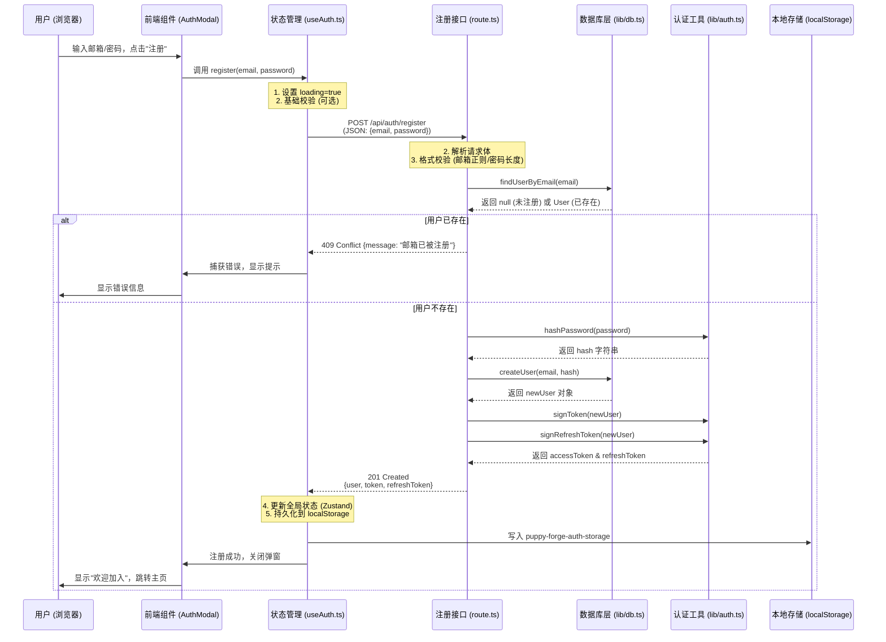

## 用户注册（邮箱 + 密码）数据流
- 这是一个典型的全栈数据交互流程。以下是详细的数据流向图和涉及的关键文件解析。

## 🔄 核心数据流图 (Data Flow)

## 📂 涉及的关键文件与职责详解

### 1.前端交互层

文件: components/AuthModal.tsx (或你的登录注册表单组件)

职责: 收集用户输入，调用 Hook，处理 UI 反馈（Loading 状态、错误提示）。

关键代码逻辑:
```tsx
const { register, loading, error } = useAuth();

const handleSubmit = async (e) => {
  e.preventDefault();
  try {
    // 触发注册流程
    await register(formData.email, formData.password); 
    // 成功后通常会自动登录并关闭模态框
    onClose(); 
  } catch (err) {
    // 错误已由 Hook 捕获并存储在 state.error 中，UI 自动渲染
  }
};
```

### 2.前端状态管理层 (核心枢纽)

文件: hooks/useAuth.ts

职责: 
 - 1.发起请求: 使用 fetch 向后端发送 POST 请求。
 - 2.错误处理: 捕获网络错误或后端返回的非 2xx 状态码，解析错误消息。
 - 3.状态更新: 注册成功后，直接将返回的 user, token, refreshToken 写入 Zustand store。
 - 4.持久化: 利用 persist 中间件，自动将认证信息存入 localStorage，实现刷新页面不掉线。

关键代码逻辑:
```typescript
register: async (email, password) => {
  set({ loading: true, error: null });
  try {
    const res = await fetch('/api/auth/register', {
      method: 'POST',
      headers: { 'Content-Type': 'application/json' },
      body: JSON.stringify({ email, password }),
    });
    
    const data = await res.json();
    if (!res.ok) throw new Error(data.message);
    
    // ✅ 关键：注册即登录
    set({ 
      user: data.user, 
      token: data.token, 
      refreshToken: data.refreshToken 
    });
  } catch (err) {
    set({ error: err.message });
    throw err;
  } finally {
    set({ loading: false });
  }
}
```
### 3.后端 API 路由层

文件: app/api/auth/register/route.ts

职责: 
  - 请求验证: 检查邮箱格式、密码强度、两次密码是否一致。
  - 业务逻辑: 调用 DB 层检查用户是否存在。
  - 安全处理: 绝不直接存储明文密码，调用 auth 层进行哈希。
  - 令牌生成: 注册成功后，立即生成 Access 和 Refresh Token。
  - 响应返回: 返回脱敏后的用户信息和 Token。

关键代码逻辑:
```typescript
export async function POST(request: Request) {
  // 1. 校验输入
  if (!isValidEmail(email)) return error(400);
  
  // 2. 检查是否存在
  const existing = await findUserByEmail(email);
  if (existing) return error(409, "邮箱已注册");
  
  // 3. 加密密码 & 创建用户
  const hash = await hashPassword(password);
  const user = await createUser(email, hash);
  
  // 4. 生成令牌
  const token = await signToken(user);
  const refresh = await signRefreshToken(user);
  
  // 5. 返回结果 (自动剔除 password_hash)
  return json({ user, token, refresh }, 201);
}
```
### 4.数据库访问层 (DAL)

文件: lib/db.ts

职责: 
  - SQL 执行: 执行 INSERT INTO users ... 语句。
  - 数据映射: 将数据库行转换为 TypeScript 对象。
  - 脱敏: 确保返回给上层的数据不包含 password_hash 字段。

关键代码逻辑:
```typescript
export async function createUser(email: string, hash: string) {
  const id = crypto.randomUUID();
  db.prepare('INSERT INTO users ...').run(id, email, hash);
  // 返回时不包含 hash
  return { id, email, role: 'user', createdAt: ... };
}
```
### 5.认证工具层

文件: lib/auth.ts

职责: 
  - 密码哈希: 使用 bcryptjs 加盐哈希 (hashPassword)。
  - JWT 签名: 使用 HMAC-SHA256 生成自定义格式的 Token (signToken)。
  - 有效期管理: 设定 Access Token (如 24h) 和 Refresh Token (如 7 天) 的过期时间。

关键代码逻辑:
```typescript
export async function hashPassword(pwd: string) {
  return bcrypt.hash(pwd, 10); // 10 是盐 rounds
}

export async function signToken(user: User) {
  // 构建 payload: { userId, email, role, exp, typ: 'access' }
  // 签名: base64(payload) + '.' + hmac_sha256(base64(payload), SECRET)
  return `pf.${encoded}.${signature}`;
}
```

## 🔐 安全关键点总结
  - 传输安全: 生产环境必须使用 HTTPS，防止密码在传输中被窃听。
  - 存储安全: 数据库中只存 bcrypt 哈希值，即使库被拖库，攻击者也无法反推密码。
  - 最小权限: API 返回的 user 对象经过脱敏，绝不包含 password_hash 或 refreshToken (Refresh Token 通常只返回一次给客户端，服务端不存或只存哈希，本例简化为无状态 JWT)。
  - 防重放/篡改: JWT 包含签名，任何对 Payload 的修改都会导致签名验证失败。
  -输入清洗: 后端必须再次校验邮箱格式和密码长度，不能信任前端校验。
